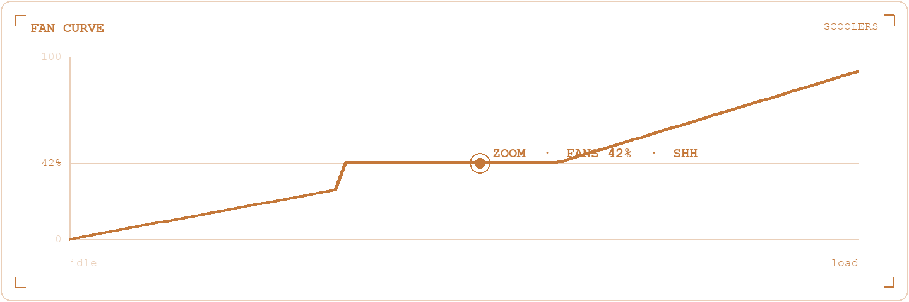

<div align="center">


<br/>

<samp>
<a href="https://gcoolers.com">gcoolers</a> ·
<a href="https://massedcompute.com">compute</a> ·
<a href="https://github.com/Massed-Compute/gpu-benchmark">benches</a> ·
<a href="https://www.youtube.com/@MassedCompute">minute</a> ·
<a href="https://gabemills.com">gabemills.com</a>
</samp>

<br/>


</div>

```
NAME
    gcool — Apple Silicon thermal governor

SYNOPSIS
    brew install gabe-mills/gcoolers/gcoolers && gcool

MEETING MODE
    Zoom / Discord / Teams → fans held at 42%. Shh.

HOT AISLE                         COLD AISLE
MacBook · GCOOLERS v3.06          gpu-benchmark · same harness
CPU 131°F  ◆ WARM                 Qwen3.8 27B  A100 / Blackwell / H100
FAN  42%   Zoom detected           GLM 5.3 Flash  4×Blackwell / 8×H100
quiet when idle                   public numbers. no vibes.
```

<p align="center">
  
</p>

<div align="center">

| toy | bit |
| --- | --- |
| [`gcoolers`](https://gcoolers.com) | thermal governor that knows you're on a call |
| [`gpu-benchmark`](https://github.com/Massed-Compute/gpu-benchmark) | same harness. public numbers. |
| [Massed Minute](https://www.youtube.com/@MassedCompute) | GPU cloud as a YouTube show |

**newest benches**

[Qwen3.8 27B obliterated](https://github.com/Massed-Compute/gpu-benchmark/blob/main/qwen3.8-27b-obliterated/qwen3.8-27b-obliterated.md) · [GLM 5.3 Flash](https://github.com/Massed-Compute/gpu-benchmark/blob/main/glm-5.3-flash/glm-5.3-flash.md) · [LFM2.5 VL 3B](https://github.com/Massed-Compute/gpu-benchmark/blob/main/lfm2.5-vl-3b/lfm2.5-vl-3b.md)

<a href="https://github.com/Gabe-Mills/gcoolers">
  
</a>

</div>

<details>
<summary>&nbsp;<b>currently</b> — arguing with a MacBook</summary>

- teaching a fan curve when to shut up
- timing tokens so the clip is honest
- printing something I could've bought

</details>

<div align="center">

<picture>
  <source media="(prefers-color-scheme: dark)" srcset="https://github-readme-activity-graph.vercel.app/graph?username=Gabe-Mills&bg_color=00000000&color=c9d1d9&line=C4783A&point=C4783A&area_color=C4783A&area=true&hide_border=true&title_color=C4783A&custom_title=last%2031%20days" />
  <source media="(prefers-color-scheme: light)" srcset="https://github-readme-activity-graph.vercel.app/graph?username=Gabe-Mills&bg_color=00000000&color=24292f&line=C4783A&point=C4783A&area_color=C4783A&area=true&hide_border=true&title_color=C4783A&custom_title=last%2031%20days" />
  
</picture>

<picture>
  <source media="(prefers-color-scheme: dark)" srcset="https://github-readme-stats-fast.vercel.app/api?username=Gabe-Mills&show_icons=true&title_color=C4783A&text_color=c9d1d9&icon_color=C4783A&bg_color=00000000&hide_border=true&include_all_commits=true&rank_icon=github" />
  <source media="(prefers-color-scheme: light)" srcset="https://github-readme-stats-fast.vercel.app/api?username=Gabe-Mills&show_icons=true&title_color=C4783A&text_color=24292f&icon_color=C4783A&bg_color=00000000&hide_border=true&include_all_commits=true&rank_icon=github" />
  
</picture>

<picture>
  <source media="(prefers-color-scheme: dark)" srcset="https://raw.githubusercontent.com/Gabe-Mills/Gabe-Mills/output/github-snake-dark.svg?v=1" />
  <source media="(prefers-color-scheme: light)" srcset="https://raw.githubusercontent.com/Gabe-Mills/Gabe-Mills/output/github-snake.svg?v=1" />
  
</picture>

<sub>powered by a Mac that runs too hot and a GPU that doesn't</sub>
<br/>
<sub>Gabe Mills — 2026/09/11</sub>

</div>
