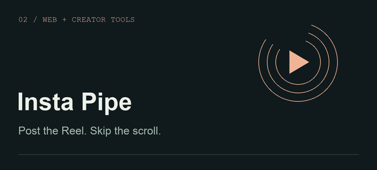

<picture>
  <source media="(prefers-reduced-motion: reduce)" srcset="assets/header-still.png">
  
</picture>

### I build things I want to exist.

GPU workflows, native Apple apps, useful web tools, and the occasional idea that ends up coming out of a 3D printer. I like working across the whole thing: **the system underneath and the experience in your hands.**

At [**Massed Compute**](https://massedcompute.com), I work on AI deployment, GPU workflows, technical guides, and creative content.

## Selected work

<table>
<tr>
<td width="50%" valign="top">

A thermal governor for Apple Silicon Macs with fan control, a menu bar app, widgets, and meeting-aware behavior.

<a href="https://gcoolers.com">Explore Gcoolers ↗</a> · <a href="https://github.com/Gabe-Mills/gcoolers">Source</a>
</td>
<td width="50%" valign="top">

A focused publishing desk for Instagram Reels: uploads, scheduling, comments, and analytics without the feed.

<a href="https://gabe-mills.github.io/insta-pipe-web/">Explore Insta Pipe ↗</a> · <a href="https://github.com/Gabe-Mills/insta-pipe-web">Website &amp; launcher source</a>
</td>
</tr>
</table>

## On my workbench

- **AI with a job to do** — local inference, GPU workflows, automation, and creative tools.
- **Apps that feel right** — native Apple experiences, unusual interfaces, and everyday utilities.
- **Ideas beyond the screen** — interactive 3D, game mechanics, and physical prints.

## The toolkit

| | Tools I reach for |
| :-- | :-- |
| **Code** | TypeScript · JavaScript · Python · Swift |
| **Interfaces** | React · SwiftUI · HTML · CSS |
| **Infrastructure** | Linux · Docker · Git · Cloudflare · GPU environments |
| **Creative** | Blender · 3D printing · AI image & video workflows |
| **AI collaborators** | Cursor · Claude Code · Codex |

## Build. Try it. Make it better.

I work with AI agents every day, from the first experiment through implementation, testing, and iteration. I care about the details that show up when someone actually uses the thing: the interaction, the rough edges, and whether it holds up outside the demo.

**Have a good “could we build this?” I'm interested.**

[GitHub](https://github.com/Gabe-Mills) &nbsp; / &nbsp; [Massed Compute](https://massedcompute.com) &nbsp; / &nbsp; [Gcoolers](https://gcoolers.com) &nbsp; / &nbsp; [Still version of the banner](assets/header-still.png)
