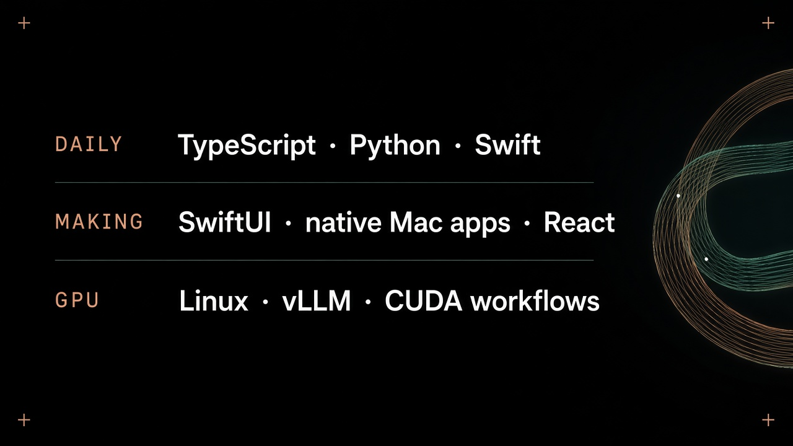
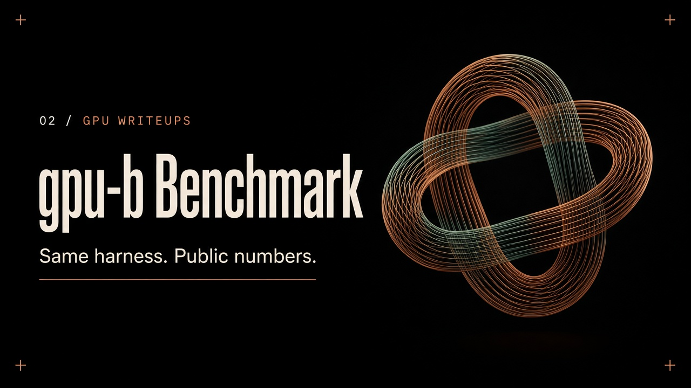

<picture>
  <source media="(prefers-reduced-motion: reduce)" srcset="assets/header-still.png">
  
</picture>

### I build things I want to exist.

GPU workflows, native Apple apps, useful web tools, and the occasional idea that ends up coming out of a 3D printer. I like working across the whole thing: **the system underneath and the experience in your hands.**

<table>
<tr>
<td width="50%" valign="top">

</td>
<td width="50%" valign="top">

</td>
</tr>
</table>

| Project | What it does |
| --- | --- |
| [`gcoolers`](https://github.com/Gabe-Mills/gcoolers) | Thermal governor for Apple Silicon — fan control, menu bar, widgets, meeting-aware. |
| [`gpu-benchmark`](https://github.com/Massed-Compute/gpu-benchmark) | Same-harness GPU writeups at Massed Compute. |

[Gcoolers](https://gcoolers.com) · [Massed Compute](https://massedcompute.com) · [gabemills.com](https://gabemills.com)

