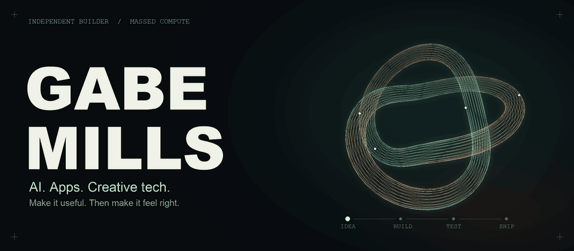
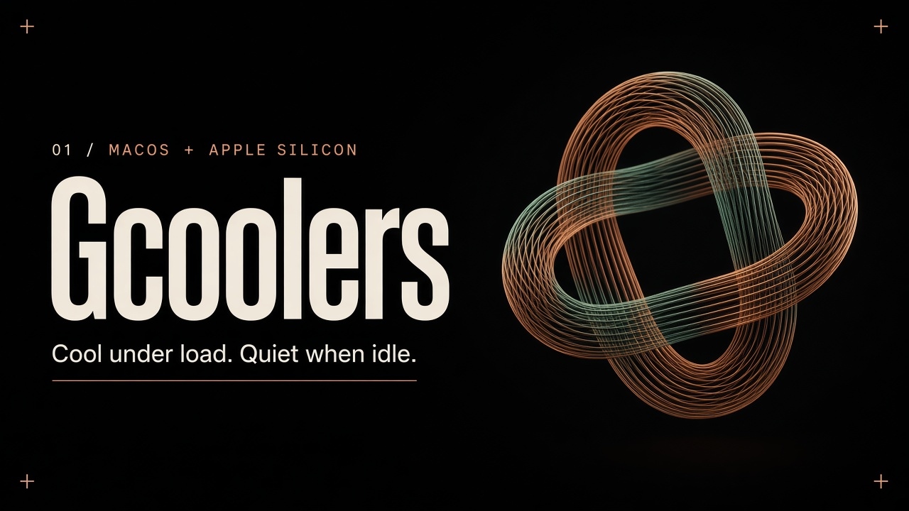

<picture>
  <source media="(prefers-reduced-motion: reduce)" srcset="assets/header-still.png">
  
</picture>

### I build things I want to exist.

GPU workflows, native Apple apps, useful web tools, and the occasional idea that ends up coming out of a 3D printer. I like working across the whole thing: **the system underneath and the experience in your hands.**

   
  A thermal governor for Apple Silicon Macs with fan control, a menu bar app, widgets, and meeting-aware behavior. 
  <a href="https://gcoolers.com">Explore Gcoolers ↗</a> · <a href="https://github.com/Gabe-Mills/gcoolers">Source</a>

